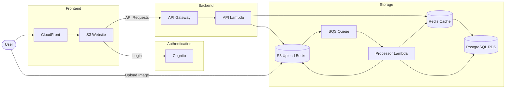
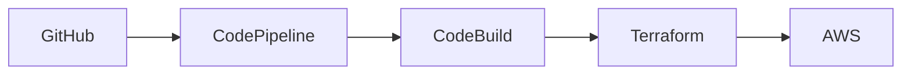
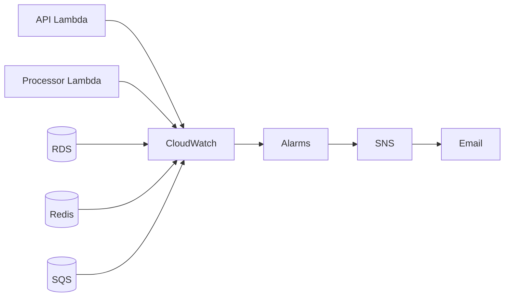

# Tring Serverless Image Processing Platform

A production-oriented serverless image processing platform built on AWS using Terraform. The application allows authenticated users to upload images directly to Amazon S3 using presigned URLs, processes uploads asynchronously through Amazon SQS and AWS Lambda, stores image metadata in Amazon RDS PostgreSQL, accelerates read performance using Amazon ElastiCache Redis, and automates infrastructure deployment through a CI/CD pipeline powered by AWS CodePipeline and CodeBuild.

---

# Architecture



---

# CI/CD Pipeline



---

# Monitoring



---

# Features

### Authentication

- Amazon Cognito User Pool
- Cognito Hosted UI
- OAuth 2.0 Authorization Code Flow
- JWT-based API authorization
- User ownership enforcement

### Image Upload

- Direct browser uploads using presigned S3 URLs
- Secure uploads without routing image data through the API
- Automatic metadata creation

### Asynchronous Processing

- S3 ObjectCreated notifications
- Amazon SQS event buffering
- Background processing with AWS Lambda
- Automatic metadata extraction

### Metadata Management

- PostgreSQL metadata storage
- Image status tracking
- File information management
- Timestamp auditing

### Redis Caching

- Cache-aside pattern
- 300-second TTL
- Automatic cache invalidation
- Accelerated read performance

### CI/CD

- GitHub source integration
- AWS CodePipeline
- AWS CodeBuild
- Terraform infrastructure deployment
- Automated database migration
- CloudFront cache invalidation

### Monitoring

- CloudWatch metrics
- CloudWatch alarms
- SNS email notifications
- Infrastructure health monitoring

---

# Technology Stack

| Category | Technologies |
|----------|--------------|
| Frontend | HTML, CSS, JavaScript |
| Backend | Python, AWS Lambda |
| Authentication | Amazon Cognito |
| API | Amazon API Gateway |
| Storage | Amazon S3 |
| Database | Amazon RDS PostgreSQL |
| Cache | Amazon ElastiCache Redis |
| Messaging | Amazon SQS, Amazon SNS |
| CDN | Amazon CloudFront |
| Infrastructure | Terraform |
| CI/CD | AWS CodePipeline, AWS CodeBuild |
| Monitoring | Amazon CloudWatch |

---

# Processing Workflow

1. User authenticates through Amazon Cognito.
2. The frontend requests an image upload session from the API.
3. The API creates an image metadata record in PostgreSQL and returns a presigned upload URL.
4. The browser uploads the image directly to Amazon S3.
5. An `ObjectCreated` event is delivered to Amazon SQS.
6. The Processor Lambda consumes the queue message and extracts image metadata.
7. PostgreSQL is updated with the extracted metadata.
8. The Redis cache for the processed image is invalidated.
9. An SNS notification is published.
10. The updated metadata is returned on subsequent API requests.

---

# API Endpoints

| Method | Endpoint | Description |
|---------|----------|-------------|
| POST | `/images` | Create image metadata and generate a presigned upload URL |
| GET | `/images` | List all images belonging to the authenticated user |
| GET | `/images/{imageId}` | Retrieve image metadata and a download URL |

---

## Create Image Upload

### Request

```http
POST /images
Authorization: Bearer <access_token>
```

```json
{
  "filename": "example.jpg",
  "contentType": "image/jpeg"
}
```

### Response

```json
{
  "imageId": "uuid",
  "uploadUrl": "https://..."
}
```

---

## List Images

### Request

```http
GET /images
Authorization: Bearer <access_token>
```

### Response

```json
{
  "images": [
    {
      "imageId": "uuid",
      "filename": "example.jpg",
      "status": "COMPLETED",
      "createdAt": "2026-06-29T09:45:00Z"
    }
  ]
}
```

---

## Get Image Details

### Request

```http
GET /images/{imageId}
Authorization: Bearer <access_token>
```

### Response

```json
{
  "image": {
    "imageId": "uuid",
    "filename": "example.jpg",
    "contentType": "image/jpeg",
    "extension": "jpg",
    "fileSize": 29222,
    "status": "COMPLETED",
    "createdAt": "2026-06-29T09:45:00Z",
    "processedAt": "2026-06-29T09:45:08Z"
  },
  "downloadUrl": "https://..."
}
```

---

# Database Schema

## Images

| Column | Description |
|---------|-------------|
| image_id | Primary key |
| owner_id | Cognito user identifier |
| filename | Original filename |
| content_type | MIME type |
| extension | File extension |
| file_size | Image size (bytes) |
| status | Processing status |
| created_at | Upload timestamp |
| processed_at | Processing completion timestamp |

---

# Redis Caching

To improve read performance, the application uses a cache-aside strategy for individual image lookups.

| Endpoint | Cache Strategy | TTL |
|----------|----------------|-----|
| `GET /images/{imageId}` | Cache Aside | 300 seconds |

When an image is processed, the corresponding cache entry is automatically invalidated to ensure subsequent requests return the latest metadata.

---

# S3 Object Structure

```text
uploads/
└── {ownerId}/
    └── {imageId}/
        └── {filename}
```

Example

```text
uploads/
└── 2478c428-0091-70f3-8115-6ebfb24685e8/
    └── 92e0e3c9-a32c-41de-ac6d-7c67668e89c6/
        └── image.jpg
```

---

# Deployment

Clone the repository:

```bash
git clone https://github.com/<username>/tring-serverless-image-processing-platform.git
cd tring-serverless-image-processing-platform
```

Initialize Terraform:

```bash
cd terraform
terraform init
```

Review the deployment:

```bash
terraform plan
```

Deploy the infrastructure:

```bash
terraform apply
```

Destroy the infrastructure:

```bash
terraform destroy
```

---

# Repository Structure

```text
.
├── lambda/
│   ├── api/
│   ├── processor/
│   ├── migration/
│   └── pre_token_generation/
│
├── terraform/
│   ├── modules/
│   │   ├── api_gateway/
│   │   ├── cloudfront/
│   │   ├── cognito/
│   │   ├── codebuild/
│   │   ├── codepipeline/
│   │   ├── lambda/
│   │   ├── networking/
│   │   ├── notification/
│   │   ├── rds/
│   │   ├── redis/
│   │   ├── s3/
│   │   └── ...
│   │
│   ├── main.tf
│   ├── variables.tf
│   ├── outputs.tf
│   └── backend.tf
│
├── website/
│   ├── index.html
│   ├── styles.css
│   ├── scripts.js
│   └── config.js.tpl
│
├── buildspec.yml
└── README.md
```

---

# Security

- OAuth 2.0 Authorization Code Flow
- JWT-based API authorization
- Private VPC networking for compute and data services
- Presigned S3 uploads
- Least-privilege IAM roles and policies
- HTTPS delivery through Amazon CloudFront
- Secrets managed using AWS Systems Manager Parameter Store

---

# Project Highlights

- Infrastructure fully managed using Terraform
- Modular Infrastructure-as-Code design
- Fully serverless event-driven architecture
- Automated CI/CD pipeline using AWS CodePipeline and CodeBuild
- Automated PostgreSQL schema migration during deployment
- Redis cache-aside implementation for individual image retrievalxxx  
- CloudWatch monitoring with SNS alerting

---

# Author

**Tarun Harish**